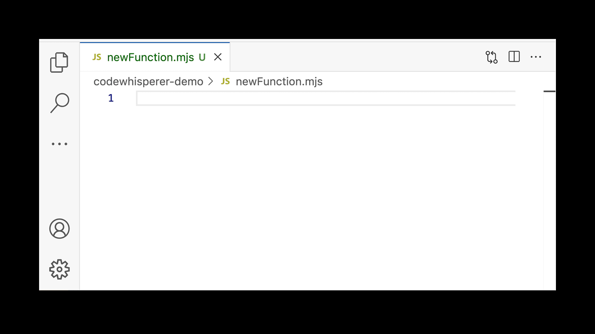
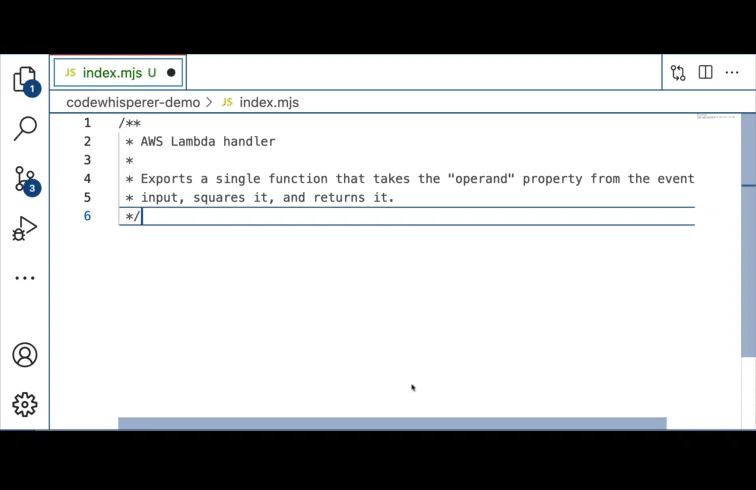
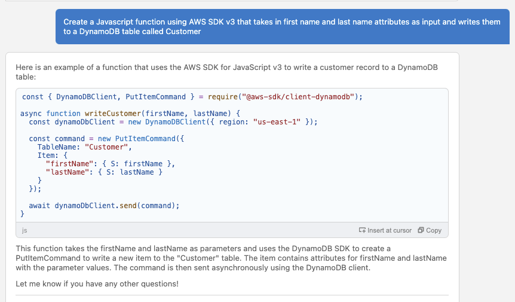

# Code Creation
One of the primary goals of AI Coding Assistants is to increase the productivity of developers in creating code.

## Code Completion

With code completion, `CodeWhisperer` makes suggestions inline as code is written in the IDE. This has been around for some time, and is known by the term `IntelliSense` in Visual Studio Code.

The challenge with code completion is that developers initiate the process by writing code and they are driving the implementation detail.

Try out code completion for yourself by starting to create the handler for an `AWS Lambda` function.

## Code Generation

> **TOP TIP**: Personal experience has found that sometimes, the response when trying to generate code (programming language, Infrastructure as Code, SQL) is a series of further comments. When this happens, the best approach is to start typing the code you want to be generated

With code generation, a developer writes a comment in natural language giving specific and concise requirements. This information, alongside the surrounding code including other open files in the editor, act as the input context. `CodeWhisperer` returns a suggestion based on this context.

`Amazon CodeWhisperer` is trained on billions of lines of Amazon internal and open source code. This gives `CodeWhisperer` an advantage when it comes to making suggestions for using AWS native services. In the example below, `CodeWhisperer` understands from the input context that we want to create a handler for an `AWS Lambda` function, and suggests a correct signature and function implementation.

Try this out for yourself using the various files in the `code-generation` folder.

There are techniques to help you generate the best recommendation, and you can find out more details in this blog post on [Best practices for prompt engineering with Amazon CodeWhisperer](https://aws.amazon.com/blogs/devops/best-practices-for-prompt-engineering-with-amazon-codewhisperer/).

## Infrastructure as Code Support
`CodeWhisperer` support for creating code extends beyond just programming languages and into Infrastructure as Code (IaC) tools such as `CloudFormation`, `AWS CDK` and `Terraform`.

Try out how `Amazon CodeWhisperer` will generate CloudFormation by using the `template.yaml` file in the `iac-support` folder.

## SQL Support
`CodeWhisperer` also supports the creation of SQL as a standard language for database creation and manipulation. This covers Data Definition Language commands (such as creating tables and views) as well as Data Manipulation Language commands (from simple inserts through to complex queries with joins across tables).

Try this out for yourself by using the `generate-sql.sql` file in the `sql-support` folder.

## Amazon Q in the IDE
One of my favourite ways of generating code today is using the `Amazon Q` feature in the IDE. This allows you to create a specific request that is used as the input context.

> **TOP TIP**: Underlying LLMs are trained on a corpus of knowledge that goes back a number of years. When a new version of a framework or library is released (such as with the AWS SDK V3), you should be explicit in the request about the version you wish to use, in order to get a better response

