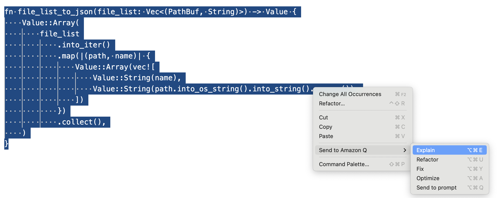
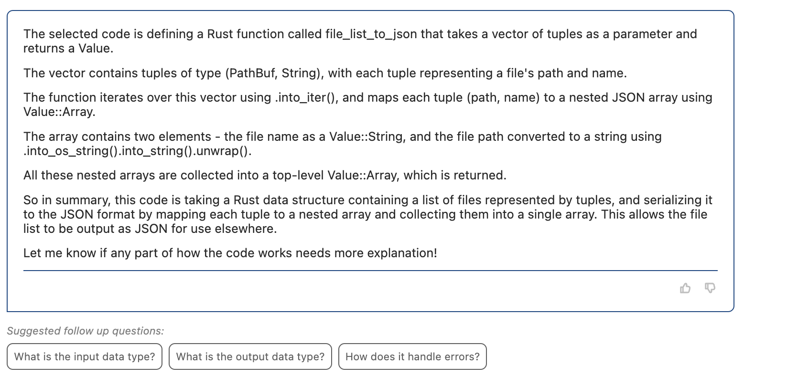
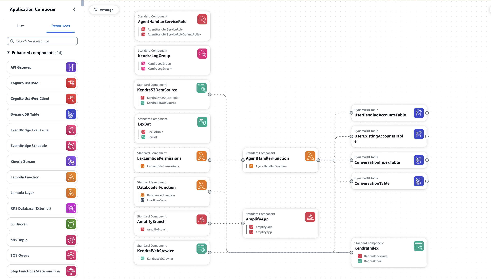

# Application Understanding
One of the most valuable use cases for GenAI is helping to understand existing applications. A common problem is supporting an application with limited if any documentation, written in an unfamiliar programming language or style, and with no comments in the code.

## Explaining Code
Working in combination with `CodeWhisperer` in your IDE, you can send whole code sections to `Amazon Q` and ask for an explanation of what the selected code does. To show how this works, we open up the file.rs file cloned from this [GitHub repository](https://github.com/rust-lang/docs.rs/blob/master/src/db/file.rs). This is part of an open source project to host documentation of crates for the Rust Programming Language, which is a language we are not familiar with.

We select a code block from the file, right-click, and then send to `Amazon Q` to explain:

`Amazon Q` provides a detailed breakdown of the function that has been written in Rust, and the key activities that it carries out. What is really useful in this case, is `Amazon Q` suggests follow up questions to help you get an even better understanding of the code. This allows you to chat with and ask questions about the code segment:

## Application Visualisation
A new feature that is incredibly useful is to visualise how an application is composed using `Application Composer` directly within the IDE. At the end of last year, `Application Composer` announced support for all 1000+ resources supported by CloudFormation.

This now works for any application running in AWS, even if not originally deployed through `CloudFormation`, with the introduction of the `AWS CloudFormation IaC Generator` (for more information see [Infrastructure as Code Generator](https://docs.aws.amazon.com/AWSCloudFormation/latest/UserGuide/generate-IaC.html)). This allows you to generate a `CloudFormation` template. Within VSCode, you can select the template, right-click, and select "Open with Application Composer".

The screenshot below uses the `CloudFormation` template from an AWS samples application in GitHub which can be found [here](https://github.com/aws-samples/generative-ai-amazon-bedrock-langchain-agent-example).

