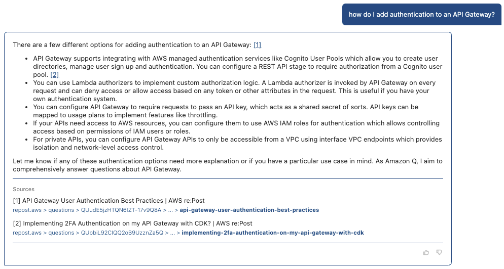
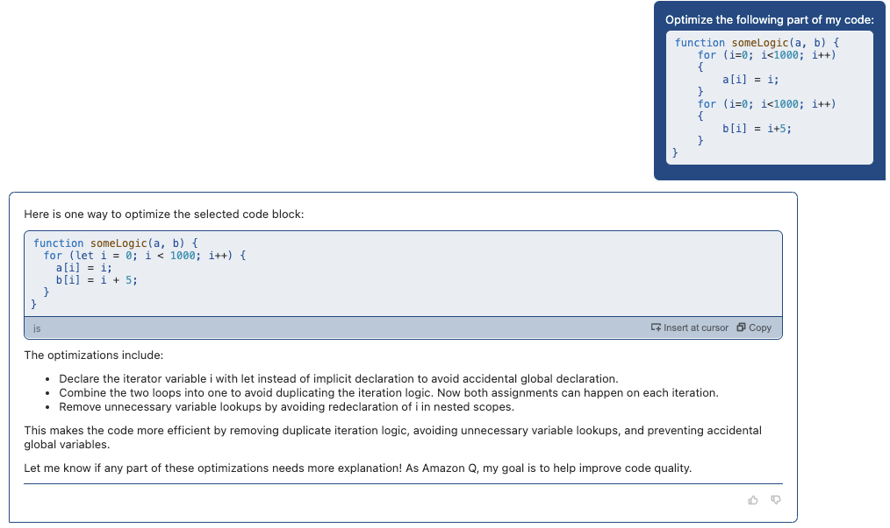
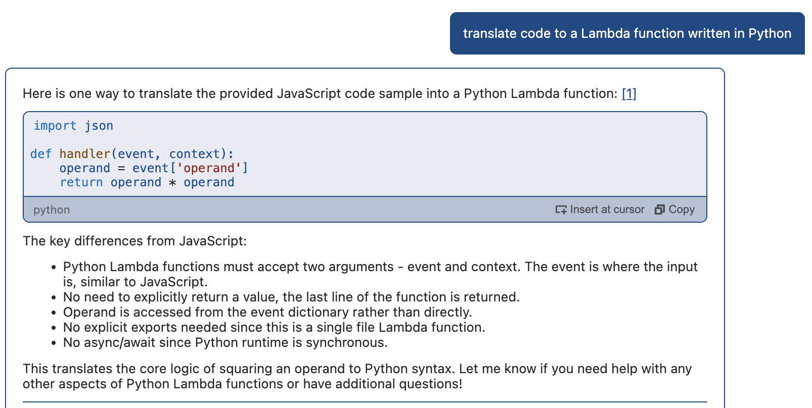

# Application Modernisation
A massive problem for organisations is the amount of technical debt growing in legacy applications. The challenge here is how to modernise these applications. The starting point is to make sure you understand the application in question using the approaches above. In addition, a number of other capabilities are available.

## Chat with Amazon Q
Amazon Q is available in both the console and the IDE to answer questions around AWS. This allows you to ask questions about AWS services, limits and best practices alongside software development.

The generated content returned contains links to the source articles, that allow you to do more in-depth reading to validate the response. Again, when writing code in the editor, this allows the developer to remain in the IDE to ask these questions, reducing the distraction and the context switching.

## Code Transformation
Code Transformation is a formal feature of Amazon Q. It is currently available in preview with support to carry out complete application upgrades from Java 8 or Java 11 to Java 17. Coming soon is support to perform .NET Framework to cross-platform .NET upgrades to migrate applications from Windows to Linux faster. Watch this video on a [Code Transformation Example](https://youtu.be/q8B3bridbpU) to see the steps involved to automatically update a Java application. Then try it out for yourself on the Java 8 application in the `code-transformation` directory.

The internal Amazon results are impressive, with 1000 production applications upgraded from Java 8 to Java 17 in just two days, with an average of 10 minutes to upgrade each application.

## Code Optimisation
Code optimisation is a concept supported by Amazon Q through its built-in prompts. In the example below, we have inefficient code with two loops that could be combined into a single loop. This is correctly detected with suggestions made to optimise the code.

You can try out some examples of how `Amazon Q` makes code optimisation suggestions by using any of the functions declared in the `code-optimisation.js` file in the `code-optimisation` folder.

## Code Translation
Code translation is another concept support by Amazon Q through prompts. As always, the accuracy and quality of the code generation is dependent upon the size and quality of the training data. In this context, there is more support for languages such as Java, Python and JavaScript than C++ or Scala. In the screenshot below, we have taken an AWS Lambda function written in JavaScript and asked Amazon Q to translate to Python.

