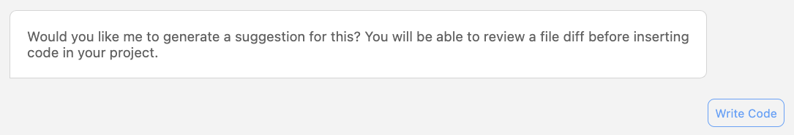

# Feature Development
Feature Development is a formal feature of Amazon Q. You explain the feature you want to develop, and then allow Amazon Q to create everything from the implementation plan to the suggested code.

For this example, we create an application using an AWS SAM quick start template for a serverless API. We then ask Q to create a new API for us.

Amazon Q uses the context of the current project to generate a detailed implementation plan as shown below.

By selecting 'Write Code', Amazon Q then generates the code suggestions, using the coding style as already set out in the current project.

This results in the proposed code suggestions, whereby you can choose to click on each file to view the differences, and finally choose whether or not to accept the changes.

This has the promise of a hugely powerful feature. In the screenshots above, we have shown how Amazon Q has taken a natural language instruction, and created everything from the Infrastructure-as-Code, function implementation, and unit tests.
