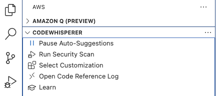
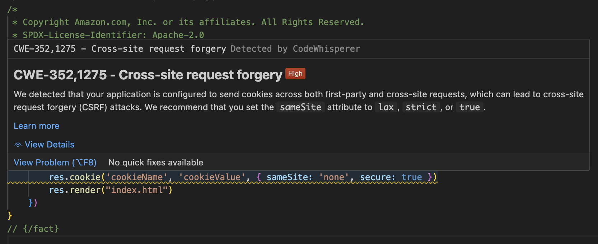

# Vulnerability Scanning

It is critical to prevent vulnerabilities being present in your application, and the earlier these are detected and resolved in the development life cycle the better. `CodeWhisperer` can detect security policy violations and vulnerabilities in code using static application security testing (SAST), secrets detection, and Infrastructure as Code (IaC) scanning.

Within `CodeWhisperer`, you can select to run a security scan.

This performs the security scan on the currently active file in the IDE editor, and its dependent files from the project.

Security scans in `CodeWhisperer` identify security vulnerabilities and suggest how to improve your code. In some cases, `CodeWhisperer` provides code you can use to address those vulnerabilities. The security scan is powered by detectors from the [Amazon CodeGuru Detector Library](https://docs.aws.amazon.com/codeguru/detector-library/).

In the screenshot below, we use sample code that contains a vulnerability to Cross Site Request Forgery (CSRF), and this is picked up by the scan.

Having detected there is an issue, we select the function with the vulnerability, and send it to `Amazon Q` to fix. `Amazon Q` generates code that we copy or insert directly into the editor, as well as providing details about the issue and resolution, and suggesting follow up questions if we want to learn even more.

You can try out the CSRF vulnerability for yourself by scanning the `cross_site_request_forgery.js` file, or see how vulnerabilities are also detected in `CloudFormation` files by scanning the `cf-vulnerability.yaml` file.