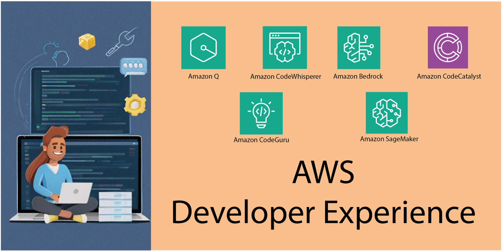

# Awesome AWS Developer Experience
This repository provides simple demos that can be run in your own AWS account to try out features and capabilities of the AWS next generation developer experience. It also provides a curated list of guides and resources for the associated AWS services - in particular Amazon Q for Developer and Amazon Bedrock. This list includes both community created content as well as content created by AWS.

_Want to add something? Open a PR!_ 🙂

## Similar Guides
There are a number of similar repos targetting other AWS services. A non-exhaustive list is provided below:

* [Awesome EventBridge](https://github.com/boyney123/awesome-eventbridge)
* [Awesome DynamoDB](https://github.com/alexdebrie/awesome-dynamodb)
* [Awesome ECS](https://github.com/nathanpeck/awesome-ecs)

## Demo Features

* [Code Creation](./1-code-creation/code-creation.md)
* [Application Understanding](./2-application-understanding/application-understanding.md)
* [Application Modernisation](./3-application-modernisation/application-modernisation.md)
* [Feature Development](./4-feature-development/feature-development.md)
* [Vulnerability Scanning](./5-vulnerability-scanning/vulnerability-scanning.md)

## Videos

* [Building Terraform Projects with Amazon Q Developer](https://www.youtube.com/watch?v=JSjOUX3zVg8) - Kevon Mayers shows you how to install and use the Amazon Q VSCode extension to maximize your Terraform development experience with AI-powered features like block code completion, inline code completion, code analysis/troubleshooting, and more. Whether you're a seasoned Terraform developer, or just getting started, Amazon Q Developer has got your back!

* [Improve Developer Productivity Using AWS GenAI Capabilities - AWS Community Day Turkiye](https://www.youtube.com/watch?v=xfux7vAp1qU) - Matt Lewis demos many of the features and capabilities available in Amazon Q for Developer

* [I tried coding with Amazon CodeWhisperer... This is what happened](https://www.youtube.com/watch?v=erO_6AX_DXk) - Milan Jovanović shows us how to use Amazon CodeWhisperer from Visual Studio. He also shares his thoughts on using this tool and what he thinks about AI-powered coding in general

### AWS re:Invent 2023 Videos

* [AWS re:Invent 2023 - Build without limits: The next-generation developer experience at AWS](https://www.youtube.com/watch?v=8mUosAh3gLc) - Adam Seligman provides updates on the latest AWS developer tools and services, including capabilities powered by generative AI, low-code abstractions, cloud development, and operations.

* [AWS re:Invent 2023 - Amazon Q: Your new assistant and expert guide for building with AWS](https://www.youtube.com/watch?v=lBJHJmkotcI) - Clare Liguori shows us how Amazon Q is transforming the developer experience by speeding up a range of tasks as you research how to get started, evaluate system design, build secure and scalable applications, upgrade existing applications, and optimize application performance.

* [AWS re:Invent 2023 - New AWS generative AI features and tools for developers](https://www.youtube.com/watch?v=pVtVGcVH8iw) - See the newest AWS tools and features that make it easier for builders to solve problems with minimal technical expertise and that help technical teams boost productivity

* [AWS re:Invent 2023 -Automate app upgrades & maintenance using Amazon Q Code Transformation](https://www.youtube.com/watch?v=LY76tak6Z1E) - Watch how Amazon Q can expedite critical upgrade tasks, transforming applications to use the latest language features and versions

* [AWS re:Invent 2023 - Best practices for Amazon CodeWhisperer](https://www.youtube.com/watch?v=F_dSkRHCXBc) - Learn about best practices for engaging with Amazon CodeWhisperer, which uses an underlying foundation model to radically improve developer productivity by generating code suggestions in real time

* [AWS re:Invent 2023 - Boost developer productivity with Amazon CodeWhisperer](https://www.youtube.com/watch?v=Kvx3ksVFB-E) - Get insights into how to evaluate and measure productivity with the adoption of generative AI–powered tools. 

## Blog Posts

* [Goodbye Elasticsearch, Hello OpenSearch: A Golang Developer's Journey with Amazon Q (Lessons Learned)](https://community.aws/content/2fBVnCWwN5TEa1wEWl5Wah7Vb2A/migrating-golang-project-using-elasticsearch-to-opensearch-with-amazonq) - a blog post by Ricardo Ferreira showing how he used Amazon Q to migrate an application written in Go to replace the backend from Elasticsearch to OpenSearch
* [Using the Amazon Q Feature Development Capability to produce documentation](https://it20.info/2024/3/using-the-amazon-q-feature-development-capability-to-produce-documentation/) - a blog post by Massimo Re Ferrè detailing how the Amazon Q feature development capability can be used to write documentation
* [Transforming Diagrams into Code: AI-Powered IaC with Claude 3 and Amazon Bedrock](https://letsmake.cloud/transforming-diagrams-into-code) - a blog post by Monica Colangelo looking at how you can take an architecture diagram and translate into Infrastructure-as-Code with Claude 3 and Amazon Bedrock

## Workshops

* [Amazon Q, your AWS Expert](https://catalog.us-east-1.prod.workshops.aws/workshops/140d775f-670f-4e22-96e0-545515e7b35f/en-US)
* [Next Generation Developer Experience with Amazon Q and Amazon CodeWhisperer](https://catalog.workshops.aws/next-gen-dev-data-analysis-with-q/en-US)
* [Building with Amazon Bedrock and LangChain](https://catalog.workshops.aws/building-with-amazon-bedrock/en-US)
* [Amazon Bedrock Workshop](https://catalog.us-east-1.prod.workshops.aws/workshops/a4bdb007-5600-4368-81c5-ff5b4154f518/en-US)

## Courses

* [Amazon CodeWhisperer - Getting Started](https://explore.skillbuilder.aws/learn/course/internal/view/elearning/16405/amazon-codewhisperer-getting-started) - AWS SkillBuilder free 30 minute course to help you get started with CodeWhisperer in your IDE